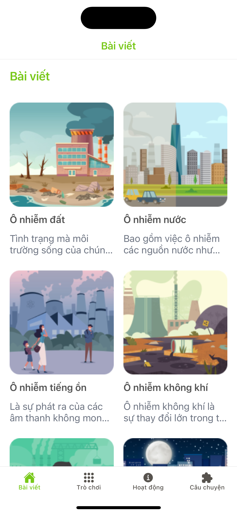
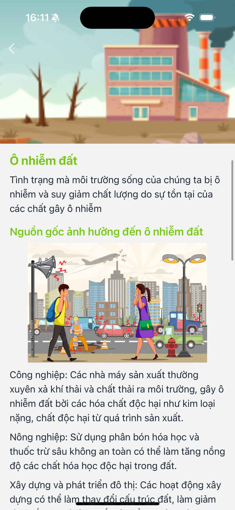
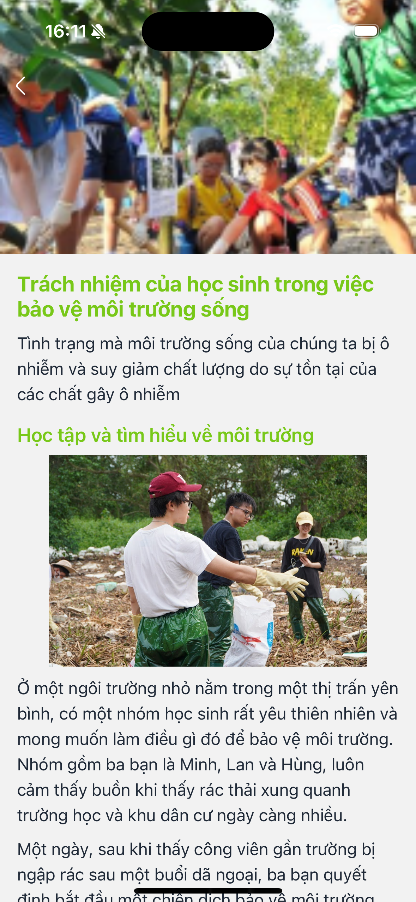

# Earth Guardian

## Demo App
<!-- Link Vid Demo -->

## Table of Contents
- [Earth Guardian](#earth-guardian)
  - [Demo App](#demo-app)
  - [Table of Contents](#table-of-contents)
  - [About](#about)
  - [Features](#features)
  - [Screenshots](#screenshots)
  - [Getting Started](#getting-started)
    - [Prerequisites](#prerequisites)
    - [Installation](#installation)

## About
<!-- App description -->

## Features
<!-- Your features app -->

## Screenshots
<!-- Screenshot image of some screen and place in ~/images folder from root app -->







## Getting Started

### Prerequisites

- Node.Js: https://nodejs.org/en
- Expo: https://docs.expo.dev/get-started/installation/
- Yarn: https://classic.yarnpkg.com/lang/en/docs/install/#mac-stable

### Installation

- Clone the repository to your local machine
- Install dependencies using npm or yarn
- Run the app using `yarn start` or another suitable command

```bash
git clone <git url app>
cd app_name
yarn
yarn start
